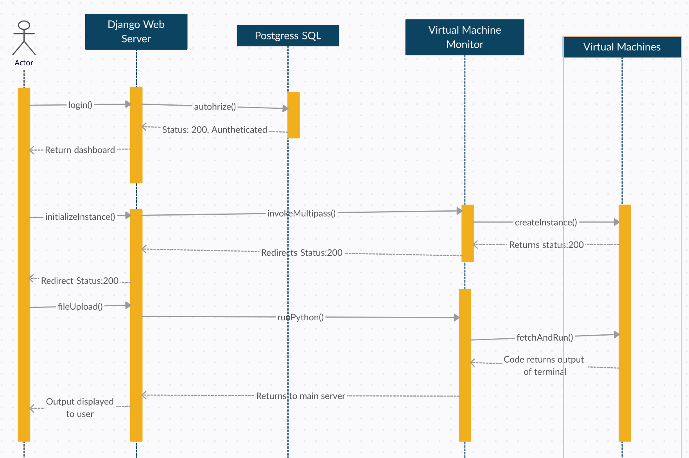

# Introduction
Serverless computing is a type of cloud computing that allows users to run their applications without having to worry about managing servers. Instead of managing servers, users can simply write and deploy their code and the cloud provider takes care of the rest. This can be a cost-effective solution for many organizations because they only pay for the resources they use, and do not have to pay for idle resources. Additionally, because the cloud provider is responsible for managing the servers, users do not have to worry about maintenance, security patches, or scaling their infrastructure. This can save organizations a significant amount of time and resources, allowing them to focus on developing their applications.

Some other advantages of serverless computing include:

* High scalability: Because the cloud provider automatically scales the infrastructure as needed, users do not have to worry about running out of capacity or dealing with performance issues during peak usage times.
* Improved reliability: Because serverless applications are distributed across multiple servers, they are less likely to go down due to a single server failure.
Better cost management: Because users only pay for the resources they use, they can save money compared to traditional server-based solutions, where they have to pay for idle resources.
* Increased flexibility: Serverless computing allows users to quickly and easily deploy their code without having to worry about managing infrastructure. This can speed up development times and make it easier for organizations to experiment with new ideas.

Overall, serverless computing offers a number of benefits for organizations, including cost savings, improved scalability and reliability, and increased flexibility.

# Goals and Objectives
We aim to create a FaaS(function-as-a-service) provider platform that allows users to efficiently run their own custom functions in a secure and scalable environment. Users just need to simply upload their code and provide a few basic configuration details, and the system would spin up a virtual machine to run their functions. The system would handle all the underlying infrastructure, so that users can focus on building their applications without worrying about managing servers. And when the function is done running, the system would return the output automatically. With the platform, users can run their functions on demand without any upfront infrastructure investment.

# Sequence Diagram
